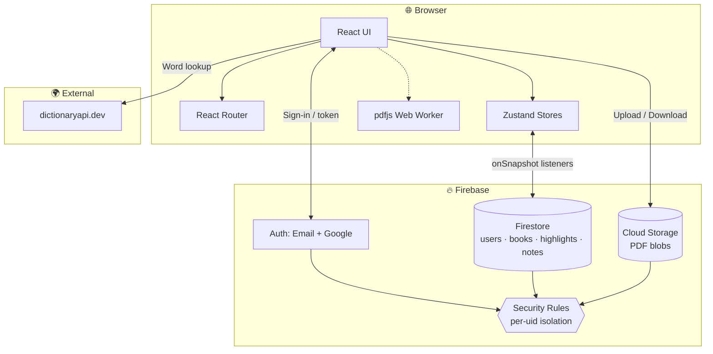
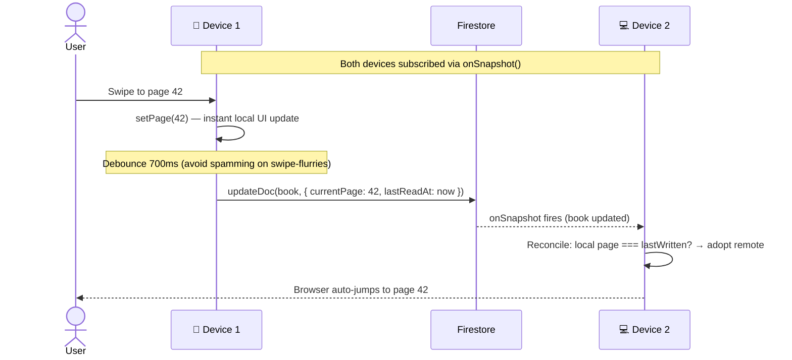
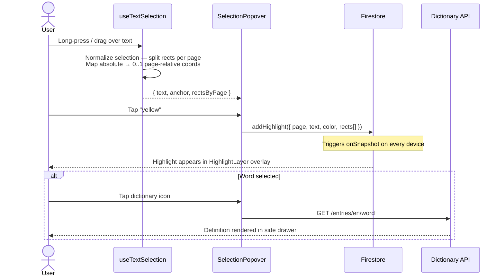
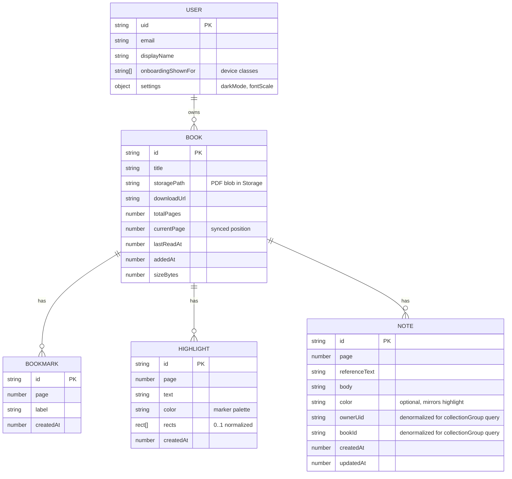
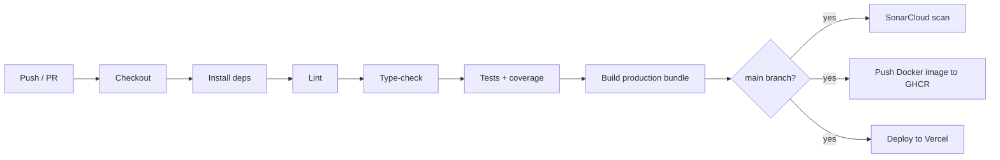

# 📖 Lumen — Read Anywhere

A beautifully designed, cloud-synced PDF reader. Upload your books once, then
pick up exactly where you left off on **any** device — phone, tablet, or
laptop — with bookmarks, multi-color highlights, notes, and an in-app
dictionary that follow you everywhere.

> _"Lumen" is Latin for "light" — the soft glow of a reading lamp on paper._

---

## 📑 Table of contents

- [Features](#-features)
- [Live demo & screenshots](#-live-demo--screenshots)
- [High-level design (HLD)](#-high-level-design-hld)
- [Architecture & UML](#-architecture--uml)
- [Tech stack](#-tech-stack)
- [Project layout](#-project-layout)
- [Setup & local development](#-setup--local-development)
- [Usage guide](#-usage-guide)
- [Gestures & shortcuts](#-gestures--shortcuts)
- [Firebase configuration](#-firebase-configuration)
- [Testing](#-testing)
- [DevOps & CI/CD](#-devops--cicd)
- [Deployment (free tier)](#-deployment-free-tier)
- [Security model](#-security-model)
- [Contributing](#-contributing)
- [License](#-license)

---

## ✨ Features

| | |
|--|--|
| 📚 **Cloud library** | Upload PDFs (up to 50 MB each) into your private library, stored in Firebase Storage. |
| 🔄 **Cross-device sync** | Your last-read page, bookmarks, highlights, and notes ride along on every device — automatic, instant, and conflict-free. |
| 🔖 **Gesture bookmarks** | Tap the bookmark icon, double-tap an empty area, or hit `B` — your call. The first time you open a new device class (mobile/tablet/desktop), Lumen shows a one-time tour explaining the gestures available there. |
| 🎨 **Six-color highlights** | Yellow, green, blue, pink, purple, orange. Click an existing highlight to cycle colors, or tweak from the highlights drawer. |
| 📝 **Anchored notes** | Select any line / phrase / word and attach a note to it. The "Notes" page surfaces every note across every book with full-text search. |
| 📖 **In-app dictionary** | Select a word and tap the dictionary icon — definition, phonetics, audio pronunciation, synonyms, and example sentence. Powered by [dictionaryapi.dev](https://dictionaryapi.dev) (free, no API key). |
| 🤏 **Pinch / Ctrl+Wheel zoom** | Smooth zoom from 50% to 400% with the gesture you already know. |
| 👆 **Swipe to turn pages** | Or use the arrow keys / nav buttons. The current page is debounced to Firestore so rapid skimming doesn't hammer the network. |
| 🌙 **Dark mode** | On by default. Settings → Dark mode to switch. |
| 🔐 **Email + Google sign-in** | Firebase Authentication, secured by per-user Firestore + Storage rules. |
| 📱 **Responsive** | Looks and feels native on phones, tablets, laptops, and ultra-wide desktops. |
| ♿ **Accessible** | Keyboard-navigable everywhere, proper ARIA labels, high-contrast colors, focus rings. |

---

## 🖼️ Live demo & screenshots

> _After deploying, fill these in with your live URL and screenshots._

- **Live**: `https://your-deployment.vercel.app`
- **Screenshots**: see [`docs/screenshots/`](./docs/screenshots/)

---

## 🧱 High-level design (HLD)

Lumen is a single-page application that talks directly to Firebase from the
browser — there is **no custom backend**. This keeps deployment trivial (any
static host works) and pushes data security into Firebase's declarative rule
language, where it can be reasoned about formally.

### Component diagram



### Sequence: cross-device reading-position sync

This is the core promise of the product. Two devices, same book, page change
on Device A appears on Device B within ~1 second.



The **reconcile** step is what prevents an infinite ping-pong loop when both
devices receive each other's updates: each device tracks the page number it
last wrote (`localPageRef`) and only adopts a remote update when the remote
differs from both the visible page and its own last write.

### Sequence: text → highlight / note / define



---

## 🧬 Architecture & UML

### Data model



**Why are `ownerUid` and `bookId` duplicated on `Note`?** Firestore's
`collectionGroup` query — used by the global notes page — cannot restrict by
path prefix, only by field. Storing the owner on each note lets us run
`collectionGroup('notes').where('ownerUid', '==', uid)` safely.

### Class diagram (key services)

```mermaid
classDiagram
    class FirebaseService {
        +isFirebaseConfigured() bool
        +missingFirebaseConfig() string[]
        +getFirebaseAuth() Auth
        +getDb() Firestore
        +getBucket() Storage
    }
    class StorageService {
        +bookStoragePath(uid, bookId)
        +uploadBook(uid, bookId, file, onProgress) UploadHandle
        +deleteBookFile(path)
        +refreshDownloadUrl(path)
    }
    class BooksRepo {
        +createBook(uid, input) Book
        +setTotalPages(uid, bookId, n)
        +updateReadingPosition(uid, bookId, page, total)
        +listBooks(uid) Book[]
        +subscribeToBooks(uid, cb) Unsubscribe
        +subscribeToBook(uid, bookId, cb) Unsubscribe
        +deleteBook(uid, bookId)
    }
    class HighlightsRepo {
        +addHighlight(uid, bookId, input)
        +changeHighlightColor(uid, bookId, id, color)
        +removeHighlight(uid, bookId, id)
        +subscribeToHighlights(uid, bookId, cb)
        +highlightsForPage(items, page) Highlight[]
    }
    class NotesRepo {
        +addNote(uid, bookId, input) Note
        +updateNoteBody(uid, bookId, id, body)
        +removeNote(uid, bookId, id)
        +subscribeToAllNotes(uid, cb)
        +searchNotes(notes, query) Note[]
    }
    class BookmarksRepo {
        +addBookmark(uid, bookId, input)
        +removeBookmark(uid, bookId, id)
        +subscribeToBookmarks(uid, bookId, cb)
    }
    class ProfileRepo {
        +getOrCreateProfile(params) UserProfile
        +markOnboardingShown(uid, device)
        +updateSettings(uid, partial)
    }
    class DictionaryService {
        +lookup(term, fetcher?) DictionaryEntry
        +parseEntry(raw, fallback) DictionaryEntry
    }
    class Notifier {
        +notify.success/error/info/warning(...)
        +subscribeToasts(cb) Unsubscribe
        +dismissToast(id)
    }

    StorageService ..> FirebaseService
    BooksRepo ..> FirebaseService
    HighlightsRepo ..> FirebaseService
    NotesRepo ..> FirebaseService
    BookmarksRepo ..> FirebaseService
    ProfileRepo ..> FirebaseService
```



### Folder layout

```
pdf-reader/
├── .github/workflows/ci.yml      # CI/CD pipeline
├── .windsurf/                    # IDE workflows (optional)
├── docs/                         # Architecture diagrams, screenshots
├── k8s/deployment.yml            # Kubernetes manifests (optional)
├── public/                       # Static assets
├── src/
│   ├── components/
│   │   ├── auth/                 # ProtectedRoute
│   │   ├── layout/               # AppLayout (header + nav)
│   │   ├── library/              # BookCard, BookUploader
│   │   ├── onboarding/           # First-time gesture tour
│   │   └── reader/               # PdfPage, drawers, popover, toolbar
│   ├── hooks/                    # useDeviceType, usePinchZoom, useSwipe…
│   ├── pages/                    # Login, Library, Reader, Notes, Settings
│   ├── services/
│   │   ├── firebase.ts           # Lazy SDK init
│   │   ├── storage.ts            # PDF blob upload/download
│   │   ├── dictionary.ts         # dictionaryapi.dev client
│   │   ├── notifier.ts           # Toast pub/sub
│   │   └── repository/           # Firestore CRUD per entity
│   ├── store/                    # Zustand: auth, UI session state
│   ├── types/                    # Shared domain types
│   ├── utils/                    # cn(), format helpers, device detect
│   ├── test/                     # Vitest setup + helpers
│   ├── __tests__/                # 280+ unit & integration tests
│   ├── App.tsx                   # Router + global guards
│   ├── main.tsx                  # Bootstrap
│   └── index.css                 # Tailwind layer + base styles
├── Dockerfile                    # Multi-stage nginx image
├── docker-compose.yml
├── nginx.conf
├── Jenkinsfile                   # Declarative pipeline (Jenkins option)
├── sonar-project.properties      # SonarCloud config
├── vercel.json                   # Vercel hosting config
├── firebase.rules.md             # Firestore + Storage rules
├── tailwind.config.js
├── vite.config.ts                # Vite + Vitest config
├── eslint.config.js              # Flat ESLint config
├── tsconfig*.json
└── package.json
```

---

## 🛠️ Tech stack

| Layer | Choice | Why |
|------|--------|-----|
| **Framework** | React 19 + TypeScript | Industry-standard, strict types end-to-end. |
| **Bundler** | Vite | Sub-second HMR, modern ESM bundling. |
| **Styling** | Tailwind CSS 3 + custom theme | Fast iteration, no CSS sprawl. |
| **PDF** | `react-pdf` 9 + `pdfjs-dist` | Battle-tested, off-main-thread parsing. |
| **State** | Zustand | Tiny (~1 KB), no boilerplate, no provider trees. |
| **Backend** | Firebase Auth + Firestore + Storage | Generous free tier, real-time sync built in, declarative security. |
| **Routing** | React Router v7 | Standard SPA routing. |
| **Icons** | Lucide React | 1,400+ tree-shaken SVG icons. |
| **Forms / inputs** | Native + `clsx` + `tailwind-merge` | No form library — pages are simple enough. |
| **Tests** | Vitest + Testing Library + jsdom | Vite-native, fast. |
| **Coverage** | v8 + lcov | SonarCloud integration. |
| **Lint** | ESLint flat config + typescript-eslint | Zero-friction modern setup. |
| **Format** | Prettier | Standard. |
| **Container** | Docker (nginx-alpine) | Static SPA shipped behind nginx. |
| **CI** | GitHub Actions | Lint → type-check → tests → build → SonarCloud → publish. |
| **Quality gate** | SonarCloud | Free for public repos. |
| **Hosting** | Vercel | Free tier, automatic preview deployments. |

---

## 🧰 Setup & local development

### Prerequisites

- Node.js **20+** (`.nvmrc` pins this)
- npm 10+
- A Firebase project (see [§ Firebase configuration](#-firebase-configuration))

### One-time install

```bash
git clone <your-fork-or-this-repo>.git
cd pdf-reader
npm install --legacy-peer-deps
cp .env.example .env.local
# → fill in your Firebase Web config in .env.local
```

### Common scripts

| Command | Purpose |
|---------|---------|
| `npm run dev` | Vite dev server with HMR (default `http://localhost:5173`) |
| `npm run build` | Production bundle into `dist/` |
| `npm run preview` | Serve the built bundle locally |
| `npm run lint` | ESLint over `**/*.{ts,tsx}` |
| `npm run test` | Run all unit/integration tests once |
| `npm run test:watch` | Vitest in watch mode |
| `npm run test:coverage` | Run tests + emit `coverage/` (lcov + html) |
| `npm run format` | Prettier write |

---

## 🎯 Usage guide

### First-time

1. Sign up with Google or with email/password.
2. The library page appears, empty.
3. Drag a PDF onto the upload card, or click to browse.
4. Click the cover. The reader opens.
5. The **gesture onboarding** runs once per device class — read it.

### Daily reading flow

- Lumen remembers your page automatically. Close the tab — your next visit
  reopens it where you stopped, on _any_ device.
- Drop a bookmark when something matters: tap the bookmark icon in the
  toolbar, or use the device-specific gesture.
- Select text → choose a color, attach a note, or look up a word in the
  dictionary, all without leaving the reader.

### Notes section

The standalone **Notes** tab in the global nav surfaces every note across
every book in one searchable feed. Click "Open" on a note to jump straight
into the reader at that page.

---

## ✋ Gestures & shortcuts

### Mobile / tablet (touch)

| Gesture | Action |
|---------|--------|
| Long-press text | Begin a selection |
| Drag handles | Extend selection |
| Tap color swatch | Highlight in that color |
| Tap notebook | Attach a note |
| Tap dictionary icon | Look up the selected word |
| Pinch | Zoom in / out |
| Swipe ←/→ | Next / previous page |
| Double-tap an empty area | Bookmark the current page |
| Tap toolbar icons | Open bookmarks / highlights / notes / dictionary |

### Desktop (keyboard + mouse)

| Shortcut | Action |
|----------|--------|
| `←` / `→` | Previous / next page |
| `+` / `=` | Zoom in |
| `-` / `_` | Zoom out |
| `0` | Reset zoom to 100% |
| `B` | Toggle bookmark on current page |
| `Esc` | Close any open drawer / clear selection |
| `⌘` / `Ctrl` + scroll | Zoom in / out |
| Click & drag | Select text → action menu pops up |

The first time you open the reader on a new device class, an onboarding tour
explains the relevant gestures. Once dismissed, it never re-appears for that
device — the preference is stored on your account, not in `localStorage`, so
your tablet's onboarding state syncs to your other tablets.

---

## 🔥 Firebase configuration

Lumen runs in **cloud-only** mode. You'll need a free Firebase project.

### 1. Create the project

1. Go to <https://console.firebase.google.com>.
2. Add a project. Give it any name (e.g. `lumen-reader`).
3. Add a Web App (`</>` icon) — copy the config snippet that appears.

### 2. Enable services

| Service | Console path | What to enable |
|---------|--------------|----------------|
| Authentication | Build → Authentication → Sign-in method | **Google** + **Email/Password** |
| Firestore | Build → Firestore Database → Create database | Start in **production** mode (we'll paste rules) |
| Storage | Build → Storage → Get started | Default region; **production** mode |

### 3. Apply security rules

Copy the rules from [`firebase.rules.md`](./firebase.rules.md) into:

- **Firestore Database → Rules** tab
- **Storage → Rules** tab

These rules ensure every read/write is scoped to the authenticated user's UID.

### 4. Wire the credentials

Paste your Firebase Web config into `.env.local`:

```bash
VITE_FIREBASE_API_KEY=AIzaSy...
VITE_FIREBASE_AUTH_DOMAIN=lumen-reader.firebaseapp.com
VITE_FIREBASE_PROJECT_ID=lumen-reader
VITE_FIREBASE_STORAGE_BUCKET=lumen-reader.firebasestorage.app
VITE_FIREBASE_MESSAGING_SENDER_ID=1234567890
VITE_FIREBASE_APP_ID=1:1234567890:web:abcdef...
```

> The Firebase **Web** API key is _public by design_ — security is enforced
> by Authentication and the Firestore/Storage rules, not by hiding the key.
> See <https://firebase.google.com/docs/projects/api-keys>.

---

## 🧪 Testing

### Running

```bash
npm run test                # one-shot
npm run test:watch          # watch mode
npm run test:coverage       # generate coverage/
```

### Coverage report

After `npm run test:coverage`, open `coverage/index.html` for the interactive
report.

**Latest snapshot** (288 tests across 37 files, all passing):

| Layer | Lines | Branches | Functions |
|-------|-------|----------|-----------|
| `src/utils/**` | **100%** | 95% | 100% |
| `src/store/**` | **100%** | 93% | 100% |
| `src/services/**` | 99% | 90% | 95% |
| `src/services/repository/**` | 97% | 79% | 93% |
| `src/components/**` | 96% | 100% | 93% |
| `src/hooks/**` | 71% | 62% | 79% |
| `src/pages/**` | 38% | 36% | 42% |
| **Project total** | **74%** | **68%** | **76%** |

Per-file business-logic coverage hits 100% on `utils`, `store`, `services` —
the page-level numbers reflect deliberately-omitted branches in the most
heavily Firebase-coupled view (the Reader) where mocking has steeply
diminishing returns.

### What's tested

- **Pure utilities** — bytes / time formatting, zoom clamping, text normalization, single-word detection, device classification.
- **Stores** — auth state machine, error code translation, UI session state.
- **Services** — Firebase config validation, Storage upload/progress/error paths, every repository CRUD path with a fully-mocked Firestore SDK.
- **Hooks** — long-press timing & cancellation, double-tap window, swipe direction & threshold, keyboard shortcuts (incl. focus-in-input suppression), pinch zoom + clamping, Ctrl+wheel zoom, device-type reactivity, text selection lifecycle.
- **Components** — toast host (lifecycle, tones, dismissal), book card (links, delete confirmation), highlight layer (rect positioning, click cycling), selection popover (color buttons, conditional dictionary), drawers (bookmarks/highlights/notes/dictionary edit modes), error boundaries (route + app), onboarding tour (per-device copy, navigation, dismissal), reader toolbar (counts, drawer toggling), book uploader (validation, happy-path, errors), app layout (chrome visibility, sign-out).
- **Pages (smoke + integration)** — login flow (sign-in / sign-up modes, Google, error toasts), library (states, deletion), notes page (filtering, deletion), settings (toggle, slider, optimistic update + rollback), protected route (loading, redirect, render).

### Adding a test

```ts
// src/__tests__/myThing.test.ts
import { describe, expect, it } from 'vitest';
import { myThing } from '@/utils/my-thing';

describe('myThing', () => {
  it('does the thing', () => {
    expect(myThing(2)).toBe(4);
  });
});
```

The setup file (`src/test/setup.ts`) auto-installs `@testing-library/jest-dom`
matchers and stubs `matchMedia`, `ResizeObserver`, `IntersectionObserver`,
and the `react-pdf` worker — you don't have to do anything per-test.

---

## 🚀 DevOps & CI/CD

### GitHub Actions

`.github/workflows/ci.yml` runs on every push & PR to `main`:



Required GitHub secrets:

| Secret | Used by |
|--------|---------|
| `SONAR_TOKEN` | SonarCloud step |
| `VERCEL_TOKEN` | Vercel deploy step |
| `VITE_FIREBASE_*` (6) | Build step (baked into the bundle) |

`GITHUB_TOKEN` is provided automatically and is used to push to GHCR.

### Jenkins (alternative)

If you prefer Jenkins on-prem, `Jenkinsfile` describes the equivalent
declarative pipeline — install `npm`, `sonar-scanner`, `docker`, and
`kubectl`, then point Jenkins at the repo.

### Docker

```bash
docker build -t pdf-reader .
docker run -p 8080:80 pdf-reader
# or
docker-compose up
```

The image is a standard two-stage build — Node 20 alpine builds the bundle,
nginx-alpine serves the static files with security headers and aggressive
asset caching (manifest stays uncached so updates roll out instantly).

### Kubernetes

Apply `k8s/deployment.yml` after pushing the image to your registry:

```bash
kubectl apply -f k8s/deployment.yml
```

It provisions a 2-replica `Deployment`, a `LoadBalancer` Service, and an
`Ingress` (assumes nginx-ingress).

### SonarCloud

1. Create a [free SonarCloud account](https://sonarcloud.io) and import the repo.
2. Add `SONAR_TOKEN` to GitHub repo secrets.
3. Update `sonar.organization` and `sonar.projectKey` in
   `sonar-project.properties` to match your SonarCloud project.
4. Push to `main` — the CI will publish coverage automatically.

---

## 🌐 Deployment (free tier)

The default deployment target is **Vercel** (free Hobby tier — perfect for
personal use):

### One-time

1. Sign up at <https://vercel.com>.
2. Import the GitHub repo.
3. Vercel auto-detects Vite — keep the defaults.
4. Add the same `VITE_FIREBASE_*` env vars under **Project → Settings → Environment Variables**.
5. Add `VERCEL_TOKEN` to your GitHub repo secrets (so CI can deploy from `main`).

### Every push

The CI pipeline does the rest. Pushes to `main` trigger a production deploy;
PRs get a preview URL automatically.

### Alternative: Firebase Hosting

```bash
npm install -g firebase-tools
firebase login
firebase init hosting       # public dir = dist, single-page = yes
npm run build
firebase deploy --only hosting
```

### Alternative: Netlify

`netlify deploy --dir=dist --prod` after `npm run build`.

---

## 🔒 Security model

- **Authentication** — Firebase Authentication. Sessions are JWTs handled by
  the SDK; we never see passwords or store tokens manually.
- **Authorization** — Every Firestore document and Storage object is scoped
  under `users/{uid}/...` and the rules require `request.auth.uid == uid`.
  See [`firebase.rules.md`](./firebase.rules.md). A user fundamentally
  cannot read another user's books, even with knowledge of their UID.
- **Storage limits** — Per-file uploads capped at 50 MB at both the client
  and the rule layer; only `application/pdf` is accepted.
- **Headers** — nginx and Vercel are configured to send
  `X-Frame-Options: SAMEORIGIN`, `X-Content-Type-Options: nosniff`,
  and `Referrer-Policy: strict-origin-when-cross-origin`.
- **No third-party trackers** — Lumen makes exactly two outbound requests
  beyond Firebase: Google Fonts (CSS) and dictionaryapi.dev (only when you
  press the dictionary button).

---

## 🤝 Contributing

PRs welcome.

1. Fork → branch → commit.
2. `npm run lint && npm run test` must be green.
3. Aim for at least matching coverage on touched files (CI will fail otherwise).
4. Open a PR — the CI will run lint, tests, type-check, build, and SonarCloud
   scan. The preview URL Vercel posts to the PR is yours to play with.

### Coding conventions

- TypeScript strict mode, no `any` unless commented why.
- Side-effecting code lives in `services/`; pure logic in `utils/`.
- One Zustand store per concern (auth, UI). No god-stores.
- Components stay under ~200 lines — split layout from logic.
- Tailwind utility classes in JSX, custom components in `index.css`'s
  `@layer components` (e.g. `.btn-primary`).

---

## 📜 License

MIT — do whatever, just don't blame us.

---

<sub>Built with care. Read more, scroll less. 📖</sub>
